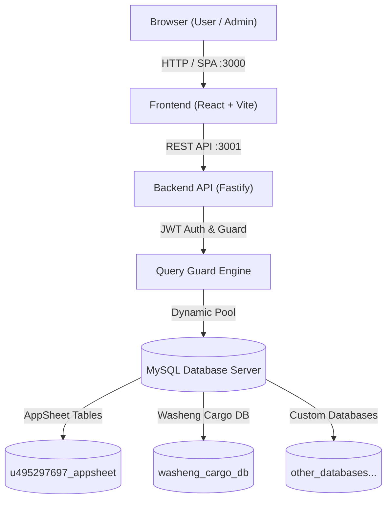

# 00. Overview — Washeng DB Studio

## 🌟 Ringkasan Proyek

**Washeng DB Studio** (Grand Control Database Core) adalah web interface modern berkinerja tinggi untuk administrasi database MySQL, terinspirasi oleh efisiensi phpMyAdmin yang dipadukan dengan desain responsif modern berbasis React dan Fastify.

Aplikasi ini dikembangkan untuk memberikan kontrol database penuh bagi ekosistem aplikasi Washeng (`washeng-manajemen-sistem`, `web-washeng-id`, dan integrasi AppSheet).

---

## 🛠️ Stack Teknologi

### Frontend
- **Framework**: React 18 + TypeScript
- **Bundler**: Vite 5
- **Styling**: Tailwind CSS + Lucide React Icons
- **Code Editor**: Monaco Editor (`@monaco-editor/react`) untuk SQL syntax highlighting & auto-complete
- **Data Rendering**: Virtualized Table Grid untuk render ribuan baris data dengan mulus

### Backend
- **Framework**: Fastify (Node.js) + TypeScript
- **Database Driver**: `mysql2/promise` dengan dynamic connection pooling
- **Security**: Fastify JWT / Bearer Token auth + Static SQL Guard Lexer
- **Server Execution**: Node.js + `tsx` untuk hot-reloading di mode development

### Environment & Infrastruktur
- **Local Runtime**: Windows 11 + Laragon (MySQL 3306)
- **Containerization**: Docker & Docker Compose (Multi-stage build)
- **Production Host**: VPS Washeng (`gc.cargo.washeng.online`)

---

## 🏗️ Diagram Arsitektur Sistem

---

## 🔗 Tautan Navigasi

- Lanjut ke [[01_BACKEND]] untuk detail backend API.
- Lanjut ke [[02_FRONTEND]] untuk detail arsitektur UI.
- Kembali ke [[00_Index]].
